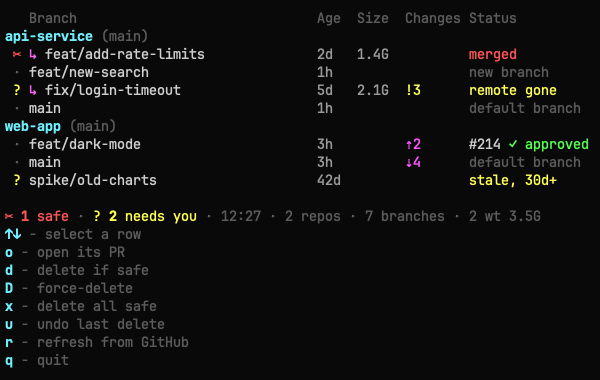

# git herd

A live terminal dashboard of the local branches and worktrees in the repos you pick,
with safe cleanup. Made for working with many AI agents at once (Claude, Codex, and
others), which leave branches and worktrees behind across many repos.



<details>
<summary>The same, as text</summary>

```
   Branch                              Age  Size  Changes Status
api-service (main)
 ✂ ↳ feat/add-rate-limits              2d   1.4G          merged
 · feat/new-search                     1h                 new branch
 ? ↳ fix/login-timeout                 5d   2.1G  !3      remote gone
 · main                                1h                 default branch
web-app (main)
 · feat/dark-mode                      3h         ⇡2      #214 ✓ approved
 · main                                3h         ⇣4      default branch
 ? spike/old-charts                    42d                stale, 30d+

✂ 1 safe · ? 2 needs you · 11:30 · 2 repos · 7 branches · 2 wt 3.5G
```

</details>

It shows, for each branch: whether it is safe to delete, its age, its worktree's disk
use, uncommitted files (`!3`), ahead/behind GitHub (`⇡1 ⇣7`), and its open PR with CI and
review state. It finds squash merges that git cannot see, by asking GitHub which commit
each PR merged.

## Install

macOS only. Pick one of the three ways:

**1. Homebrew (recommended).** Installs `gh` and `fzf` too, and `brew upgrade` updates it.

```bash
brew install cpaulson09/tap/git-herd
```

**2. One-line script.** Downloads `git-herd` into `~/.local/bin`. Run it again to update.

```bash
curl -fsSL https://raw.githubusercontent.com/cpaulson09/git-herd/main/install.sh | bash
```

**3. From a clone.** Links the clone into `~/.local/bin`, so `git pull` updates it.

```bash
git clone https://github.com/cpaulson09/git-herd.git ~/code/git-herd
~/code/git-herd/install.sh
```

Ways 2 and 3 need `~/.local/bin` on your `PATH`, and `gh` and `fzf` installed
(`brew install gh fzf`); the script tells you if any is missing.

Then sign in to GitHub once, so git herd can show PR status and find squash merges:

```bash
gh auth login
```

It needs zsh and git 2.23 or later, which macOS has. Without `fzf`, the repo picker is
a numbered list. Because the file is named `git-herd`, git runs it as `git herd`.

## Use

```bash
git herd           # watch: refresh every 5 seconds (q or Ctrl+C to stop)
git herd -w 10     # watch, refreshing every 10 seconds
git herd -1        # print once (also when the output is piped)
git herd -p        # pick which repos to herd
git herd -A        # watch, and auto-delete merged branches whose remote is gone
git herd -h        # help (git turns --help into a man-page lookup)
```

The first run lists every repo in your home folder, up to 5 folders deep (it skips hidden
folders, `Library`, `node_modules`, and `~/Music`, `~/Movies`, `~/Pictures`,
`~/Applications`, and `~/Public`, so macOS does not ask for media access), most recently used first, with branch and
worktree counts, and asks you to pick. In the picker: `Space`, `Tab`, or
a click selects (several at once), `Ctrl-A` selects all, `Enter` saves. Your picks are
saved in `~/.config/git-herd/repos`. If no repos are found, it says so and stops.

### Keys while it watches

The keys are listed under the dashboard, one per line:

| Key | Action |
|---|---|
| `↑` `↓` (or `k` `j`) | Select a row |
| `o` | Open the selected row's PR in the browser |
| `d` | Delete the selected row, if it is safe (asks; `Enter` or `y` confirms). On a merged branch that is still checked out, it first switches that folder to the default branch (refused if the folder has uncommitted changes). |
| `D` | Force-delete the selected row's unmerged work (shows the commits lost; `Enter` or `y` confirms) |
| `x` | Delete all safe rows (a list with everything selected; unselect what to keep) |
| `u` | Undo the last delete (the branch comes back; a removed worktree folder does not) |
| `r` | Refresh from GitHub: fetch every repo and refresh PR status, in the background |
| `q` | Quit |

Under the keys, a "This session" list shows the latest 8 deletes and undos, with the time. New cleanup
items and auto-deletes send a Mac notification through the terminal.

## The three groups

| Icon | Group | Meaning | Examples |
|---|---|---|---|
| `✂` | safe to delete | `x` and `d` delete it | merged; worktree folder already gone |
| `?` | needs you | you decide; `D` can force-delete | stale; remote gone; new commits after the merge; merged but has changes or is checked out |
| `·` | keep | never deleted by `d`, `x`, or auto mode | default branch; protected; new branch; open PR; not merged |

- A **new branch** was created and never committed to. Git calls it merged, because it
  points at a `main` commit, so git herd reads the branch's reflog and keeps it.
- A branch is **stale** when its last commit (or, for a new branch, its creation) is
  more than 30 days old. Stale branches are never deleted on their own.
- `main`, `master`, `staging`, `dev`, `develop`, `production`, and `release` are always
  kept.

## What a delete does

`d`, `x`, and auto mode delete only:

- branches git sees as merged (`git branch -d`);
- squash-merged branches whose local commit is the one GitHub merged, under any branch
  name or PR author (`git branch -D`);
- their worktrees, when the worktree has no uncommitted changes (`git worktree remove`);
- git's entries for worktree folders that are already gone (`git worktree prune`).

A final check before every delete refuses the default branch, protected branches, the
checked-out branch, and the repo's main folder. Every deleted branch is logged with its
commit in `~/.local/state/git-herd/deleted.log`; `u` restores it, or by hand:

```bash
git -C <repo> branch <name> <commit>
```

`git worktree remove` also deletes files git ignores, such as `node_modules` and `.env`.
The log cannot bring those back.

## Auto mode

`git herd -A` runs `git fetch --prune` on your herded repos every 5 minutes. Then, with
no question, it deletes each branch for which **all** of these are true:

1. Its work is merged into the default branch, or GitHub merged its exact commit.
2. Its branch on GitHub was deleted.
3. It is not the default, a protected, or the checked-out branch.
4. Its worktree has no uncommitted changes.

Auto-deletes are logged as `auto`, and the footer shows today's count.

### Is auto mode safe for a branch I just opened?

Yes. A branch you are working on is protected by at least one rule:

| Your situation | Protected by |
|---|---|
| New branch, no commits yet | Kept as `new branch`; its GitHub branch is not deleted |
| Commits, not pushed | Not merged; no deleted GitHub branch |
| Pushed | Its GitHub branch still exists |
| Uncommitted changes in its worktree | Rule 4 |
| Checked out in the main repo folder | Rule 3 |
| PR merged, then you added commits | Not counted as merged ("new commits after merge") |

The one case where auto mode acts: you check out an **old** branch that is already
merged and already deleted on GitHub, in a separate worktree, and you do not change
anything. Auto mode sees finished work and removes it within about 5 minutes. Press `u`
to bring the branch back. As soon as you edit a file, rule 4 protects it.

## For scripts and apps

These commands never ask questions and print no colors. A menu bar app or a script can
use them.

```bash
git herd --porcelain                       # one line per row (see below)
git herd --porcelain --refresh             # fetch and refresh PR data first (waits)
git herd --delete <repo> <branch>          # delete one row, only if d would
git herd --delete <repo> --worktree <path> # the same, picked by worktree folder
git herd --undo                            # restore the last deleted branch
```

### `--porcelain` format

One line per row, fields separated by a tab, in this order. The order will not change;
new fields are added at the end only. A field with no value is `-`. Values are never cut.
There is no header line and no totals line.

| # | Field | Example |
|---|---|---|
| 1 | Repo path | `/Users/me/code/app` |
| 2 | Branch, or `-` for a worktree with no branch | `feat/login` |
| 3 | Worktree path (the repo path for the main folder), or `-` | `/Users/me/code/app-login` |
| 4 | Group: `safe`, `needs`, or `keep` | `safe` |
| 5 | Reason, as on the dashboard | `merged`, `remote gone`, `open PR` |
| 6 | Age in seconds (last commit) | `86400` |
| 7 | Changed files in the worktree | `3` |
| 8 | Commits ahead of the remote branch | `2` |
| 9 | Commits behind the remote branch | `0` |
| 10 | Worktree size in KB (measured in the background; `-` until known) | `1468006` |
| 11 | Open PR number | `214` |
| 12 | Open PR url | `https://github.com/me/app/pull/214` |
| 13 | PR state: `open` or `draft` | `open` |
| 14 | PR CI: `pass`, `fail`, `pending`, or `none` | `pass` |
| 15 | PR review: `APPROVED`, `CHANGES_REQUESTED`, `REVIEW_REQUIRED`, or `-` | `APPROVED` |

A repo folder that is gone gives one line with branch `-`, group `needs`, and reason
`folder missing`.

### `--delete` and `--undo`

`--delete` deletes only a row that `d` deletes, with the same final check and the same
undo log. It does not switch a checked-out branch away first; that row is refused. The
repo must be one of your herded repos. It prints one line.

| Exit code | Meaning |
|---|---|
| `0` | Deleted |
| `1` | Refused: the row is not safe to delete (the line says why) |
| `2` | Wrong arguments |
| `3` | Not a herded repo, or no such branch or worktree |
| `4` | git failed during the delete |

`--undo` restores the last deleted branch, like `u`. Exit code `0` means restored; `1` means
nothing to undo, or the commit is gone.

## Settings

| Variable | Default | Effect |
|---|---|---|
| `GIT_HERD_ROOTS` | your home folder | Folders searched for repos (5 levels deep) on the first run and in `-p` |
| `GIT_HERD_WIDTH` | `80` | Widest the layout gets, in columns |
| `GIT_HERD_NOTIFY` | `1` | `0` turns off Mac notifications |

Colors, the 30-day stale limit, and the protected branch names are at the top of the
`git-herd` script.

## Files

| Path | Holds |
|---|---|
| `~/.config/git-herd/repos` | The repos you picked |
| `~/.cache/git-herd/` | PR data from GitHub and worktree sizes (refreshed in the background) |
| `~/.local/state/git-herd/deleted.log` | Every deleted branch with its commit, for undo |

## License

MIT. See [LICENSE](LICENSE). The software is provided as is, without warranty: `git herd`
deletes branches and worktrees, so check what it will delete before you confirm.
